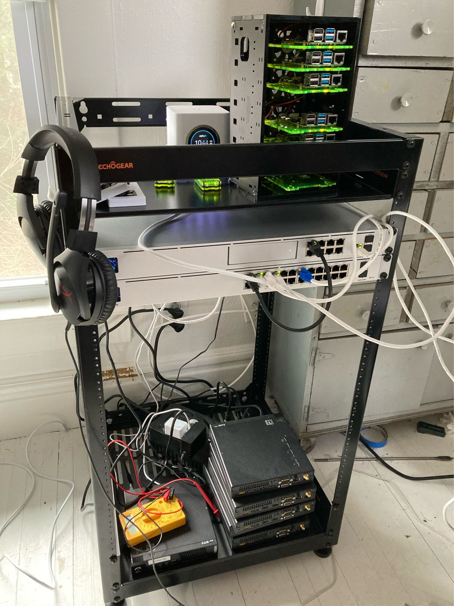

Title: First rack for my homelab
Date: 2021-03-20
Category: homelab
Summary: My first open rack for the homelab and the initial equipment I've put in it.
Tags: homelab, networking

It ain’t pretty yet but it’s a start and it’s been mostly fun so far!

I say mostly fun because running cables in a home from 1914 is a pain in the behind. A lot of plaster and lath walls makes it a challenge and though I haven't had to mess with it too much, I've been doing some planning after getting this equipment and woooooo it will be a hard fight with this old house.

Equipment pictured above:  
Unifi Dream Machine Pro  
Unifi PoE switch  
AmpliFi HD Mesh  
Echogear 20u open rack

Currently using AmpliFi to create a mesh while I wait for access points for the UDM Pro. Then I’ll just use it as a backup and store it, or see if I can set it up for my daughter's apartment.

You can also see my stack of ThinkCenter tinys and my Raspberry Pi cluster. I actually plan to rack the Raspberry Pis with a mount I found made for them (either 1u for three or 3u for sideways mounting around 12-15). Not sure how I’m going to arrange the ThinkCenters yet.

You can also see my tiny little pihole dns servers in their neon green cases. I love the Pi Zero form factor.

In case I didn’t bring it up before the raspberry pi 4s are for a Kubernetes cluster which will be for continuous learning and experiments, but also to run some custom apps I’m building for my home. And the ThinkCenters are for a Proxmox cluster for vms, experiments, etc.
