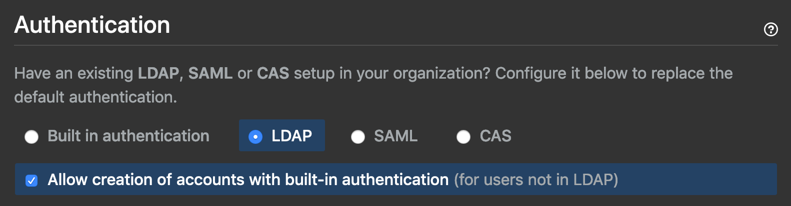

Title: Changing GitHub Enterprise users from LDAP to local
Date: 2021-04-05
Category: misc
Summary: I needed to have most users move to a different AD/LDAP server but leave a few behind on local logins. The instructions from GitHub support had issues I had to figure out on my own.
Tags: github, devops

## What?

The company I work for recently split off our entire software engineering team, part of other teams, and backoffice people into a stand alone independent software vendor. For the time being we're sharing a single GitHub Enterprise instance on prem and as part of the transition we've moved the new company staff off to their own Active Directory.

Unlike other tooling I have in place like Jenkins or Harbor, GitHub Enterprise only supports using a single AD/LDAP server (version 3.0.4 as of the publishing of this post). So the 6 or so digital marketing developers left behind at the parent company have to be converted from LDAP auth to local authentication.

Thankfully this is possible with GitHub Enterprise via this setting:



## But?

The issue is that accounts that were previously LDAP are flagged as that and this setting only allows for new accounts.

I asked GitHub for instructions on how to convert those accounts and they sent me some ghe-console commands to run. And here is what they sent me:

>If enabled, temporarily disable LDAP sync to prevent it from re-writing the LDAP associations.
>
>Connect to the server via SSH. Destroy the LDAP mapping for the users you'd like to switch to built-in authentication and set a default password for those users: (replace USERNAME with the user's actual GitHub username, and replace NEW_PASSWORD with a temporary password)


```ruby
  ghe-console -y
  User.find_by_login("USERNAME").ldap_mapping.destroy
  pass = "NEW_PASSWORD"
  user = User.find_by_login("USERNAME")
  user.update_attributes(password: pass, password_confirmation: pass)
  exit
```

>Ensure these users are not in the LDAP directory before they attempt to login again.  
>
>Re-enable LDAP sync if necessary.
>
>Instruct users to update passwords after logging in.


No doubt this is from their support team's knowledgebase. The problem is it throws errors on trying to use the code as-is.

Of course, I only had a few tracebacks to go off of like this one for `update_attributes`:

```
Traceback (most recent call last):
        3: from /github/script/console:92:in `<main>'
        2: from (irb):4
        1: from /github/vendor/gems/2.7.1/ruby/2.7.0/gems/activemodel-6.1.0.rc1.8389f99/lib/active_model/attribute_methods.rb:469:in `method_missing'
NoMethodError (undefined method `update_attributes' for #<User:0x000000000000>)
Did you mean?  update_attribute
```

So then I tried to change it to `update_attribute`:

```
Traceback (most recent call last):
        4: from /github/script/console:92:in `<main>'
        3: from (irb):4
        2: from (irb):5:in `rescue in irb_binding'
        1: from /github/vendor/gems/2.7.1/ruby/2.7.0/gems/activerecord-6.1.0.rc1.8389f99/lib/active_record/persistence.rb:612:in `update_attribute'
ArgumentError (wrong number of arguments (given 1, expected 2))
```

Damn. Well, it sorta *looks* like I'm sending two arguments instead of one, so what's going on?

Since I now know we're dealing with Ruby in the *ghe-console* I start looking up some docs and find out that **update_attribute** only does one attribute at a time and whatever format I'm sending it doesn't like.

I also look up **update_attributes** and find out it was deprecated. You only need **update** in this case. So I try **update** with the same params and it worked:

```ruby
user.update(password: pass, password_confirmation: pass)
```

Or what I originally tried works too using a different syntax for sending the attributes that I saw in the **update** documentation:

```ruby
user.update(:password => pass, :password_confirmation => pass)
```

## Gut?

Mostly just chose that subtitle to rhyme with the others, but actually using your gut to do such debugging is something I recommend. The longer you're in this business, the more experience you have running up against just weird scenarios like the above. My vendor gave me syntax that was actually out of date, but I used the info given to me for a language I have zero experience with to debug what to do next.

And I wrote them back to let them know to update their knowledgebase.

So follow your gut! Know how to look up docs even for things you don't know about or langauges you're unfamiliar with. 

Deduce. Experiment. Test. Repeat. It becomes second nature.